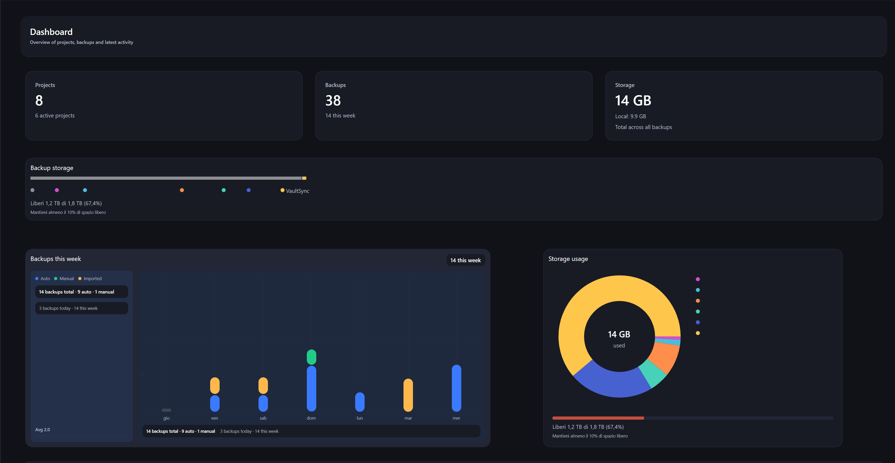

# VaultSync Documentation

This file is the canonical documentation hub for VaultSync.

For a quick file index, see `docs/README.md`.

## 1. Product Summary
VaultSync is a cross-platform snapshot and backup app for project folders.

Core pillars:
- Snapshot: capture project state.
- Backup: write snapshot content to one or more destinations.
- Verify: validate backup integrity.
- Understand: browse history, inspect snapshots, and compare changes.
- Recover: prove readable backup bytes and rehearse recovery without touching live project data.
- Sync metadata: merge backup history across machines.

## 2. Documentation Structure

### 2.1 Top-level docs
- `README.md`: public product overview and install entry point.
- `ROADMAP.md`: planned and completed work by release.
- `CHANGELOG.md`: shipped and unreleased change history.
- `CONTRIBUTING.md`: contribution, planning, and quality gates.
- `SECURITY.md`: vulnerability reporting and supported versions.

### 2.2 Operational docs
- `docs/HELP.md`: in-app help target and concise user guidance.
- `docs/RELEASING.md`: release packaging/publishing flow.
- `docs/schemas/release-manifest-v1.schema.json`: canonical direct-download
  artifact identity, size, SHA-256, and compatibility schema.
- `docs/RELEASE_1.8.7.md`: active-release status, contracts, sequencing, and gates.
- `docs/REPOSITORY_FORMATS.md`: repository layouts, compatibility boundaries,
  and emergency read-only recovery guidance.
- `docs/CROSS_MACHINE_SAFETY.md`: cross-machine threat model, identity,
  repository lease, merge, and recovery contracts.
- `docs/UPDATER.md`: patch asset contract and update flow.
- `docs/WHATS_NEW.md`: user-facing release highlights.
- `docs/DISASTER_RECOVERY.md`: recovery proofs, drills, 3-2-1 guidance, and protection behavior.
- `docs/RECOVERABILITY_ENGINE.md`: native proof trust boundary, safety limits, evidence model, retention behavior, and ProofRestore provenance.
- `docs/PRIVACY.md`: local-data and crash-reporting privacy guarantees.
- `docs/CRASH_REPORTING.md`: reviewed, user-sent crash reports and their strict data boundary.
- `docs/video/recording-guide.md`: reproducible native-app walkthrough
  recording, no-key neural narration, captions, assembly, and publishing QA.

### 2.3 Wiki docs
- `docs/wiki/Home.md`: wiki entry page.
- `docs/wiki/*`: task and feature guides (installation, backups, destinations, troubleshooting, etc.).
- `docs/wiki/Encryption.md`: backup encryption setup, format, credential storage, password changes, opening, and restore.
- `docs/wiki/Metadata-Sync.md`: portable metadata behavior, current limitations,
  and cross-machine safety guidance.

## 3. Work-Item and ID Conventions
Primary planning IDs use `VS-xxxx`.

Additional prefixes can be used in changelog triage blocks when needed:
- `ISS-xxxx`: issue bundle (cross-cutting UX/doc/cleanup work)
- `BUG-xxxx`: bug fix tracking item
- `REL-xxxx`: release-gate follow-up item

Rules:
- `VS-xxxx` remains the default for roadmap planning and implementation tracking.
- In changelog entries, prefer `VS-xxxx` for all `Added` items (including backfilled/non-roadmap additions).
- For changelog-only `ISS/BUG/REL` IDs, use version-family numbering:
  - `1.0.x` -> `10xxx` (example: `ISS-10001`)
  - `1.1.x` -> `11xxx`
  - `1.2.x` -> `12xxx`
  - `1.3.x` -> `13xxx`
  - `1.4.x` -> `14xxx`
  - `1.5.x` -> `15xxx`
  - `1.6.x` -> `16xxx`
  - `1.7.x` -> `17xxx`
  - `1.8.x` -> `18xxx`
- If `ISS/BUG/REL` is used in changelog entries, define the scope clearly in the same release section.
- Do not mix unrelated scopes under one ID.

## 4. Update Policy for Docs
When changing behavior, update all relevant artifacts in the same PR:
1. User docs (`docs/wiki/*` and/or `docs/HELP.md`)
2. Release notes (`CHANGELOG.md`, `docs/WHATS_NEW.md`)
3. Planning state (`ROADMAP.md`) when scope/status changed
4. Localization keys if UI text changed

## 5. Role-Based Reading Paths

### Maintainer release flow
1. `ROADMAP.md`
2. `CHANGELOG.md`
3. `docs/RELEASING.md`
4. `docs/UPDATER.md`
5. `docs/WHATS_NEW.md`

### Contributor feature flow
1. `CONTRIBUTING.md`
2. `ROADMAP.md`
3. relevant wiki page under `docs/wiki/`
4. `CHANGELOG.md`

### End user help flow
1. `docs/HELP.md`
2. `docs/wiki/Quick-Start.md`
3. `docs/wiki/Guided-Tour.md` for every page and the first-run path
4. `docs/wiki/Settings-Reference.md` for every setting and toggle
5. `docs/wiki/Recovery.md` for recovery drills and protection guidance
6. `docs/wiki/Encryption.md` for encrypted-backup security and password handling
7. `docs/wiki/Troubleshooting.md`
8. `docs/wiki/FAQ.md`

## 6. Quality Checklist (Docs)
Before merging documentation updates:
- Links resolve to existing files.
- Terms are consistent (Snapshot, Backup, Destination, Keep, Imported, Full, Incremental).
- New settings/UI labels referenced in docs match localization keys in `Localization/strings.en.json`.
- Versioned notes align with `CHANGELOG.md`.

## 7. Related References
- Full docs index: `docs/README.md`
- Wiki sidebar: `docs/wiki/_Sidebar.md`

## 8. Metadata Sync Contract
The metadata sync store under `<destination>/.vaultsync/meta/` currently exports:
- project identity and shape: `external_id`, `name`, `preset`, `root_path_hint`, timestamps
- `settings_json` with project-scoped settings such as `avatarColor`, `encryptionPolicy`, `encryptionKeyRef`, `preferredDestinationId`, `restoreMode`, `verificationPolicy`, `autoBackupEnabled`, and `tags`
- snapshot identity plus diff summary fields: `diff_added`, `diff_modified`, `diff_deleted`, `diff_net_bytes`, `diff_top_paths_json`
- backup identity plus operational fields: `type`, `backup_mode`, `path_rel`, `destination_alias`, `origin_machine_name`, `is_protected`, encryption flag, and non-secret crypto descriptor JSON
- tombstones for removed projects, snapshots, and backups

This contract is regression-tested in `tests/VaultSync.Core.Tests/MetadataSyncTests.cs`. If metadata behavior changes, update both the tests and this section in the same PR.

## 9. 1.8 Documentation Focus
For the `1.8` Chronicle release line, keep these areas aligned:
- History, Snapshot Explorer, and Snapshot Compare (`README.md`, `docs/HELP.md`, `docs/wiki/Snapshots.md`)
- recovery drills, native byte proofs, 3-2-1 guidance, and protected restore points (`docs/wiki/Recovery.md`, `docs/DISASTER_RECOVERY.md`, `docs/RECOVERABILITY_ENGINE.md`)
- privacy-first crash-report assistance (`docs/PRIVACY.md`, `docs/CRASH_REPORTING.md`)
- update, packaging, and release behavior (`docs/UPDATER.md`, `docs/MICROSOFT_STORE.md`, `docs/RELEASING.md`)
- release highlights (`docs/WHATS_NEW.md`, `CHANGELOG.md`)

## 10. Active 1.8.7 Documentation Contract

VaultSync 1.8.7 is in development. Use `docs/RELEASE_1.8.7.md` as the status
page and `ROADMAP.md` as the canonical scope. Planned behavior must stay labeled
as planned until its implementation, tests, and user documentation land.

Every repository-format or metadata-sync change must update, in the same
logical commit:

- `docs/REPOSITORY_FORMATS.md` for on-disk schema and compatibility;
- `docs/CROSS_MACHINE_SAFETY.md` for identity, lease, and merge invariants;
- `docs/wiki/Metadata-Sync.md` for user-visible behavior and safety guidance;
- this file for the exported field-level contract;
- executable migration and regression tests;
- `CHANGELOG.md` only when the behavior exists on the release branch.
