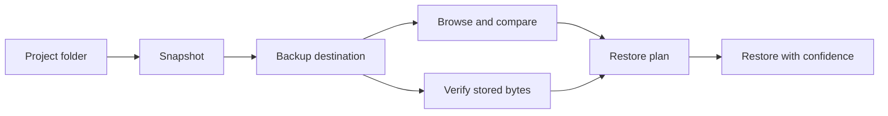
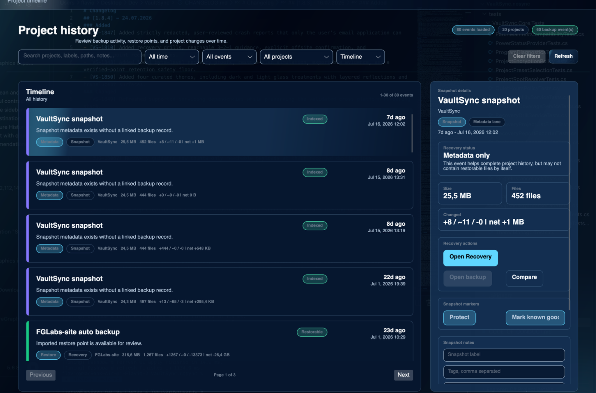

<p align="center">
  
</p>

<h1 align="center">VaultSync</h1>

<p align="center">
  <strong>Snapshot · Back up · Understand · Recover</strong>
</p>

<p align="center">
  A cross-platform backup and recovery manager for project folders, workspaces, external storage, and NAS workflows.
  VaultSync helps you inspect what is stored, verify that backup data is still readable, and understand what a restore would do before changing your files.
</p>

<p align="center">
  <a href="https://github.com/ATAC-Helicopter/VaultSync/releases/latest"><strong>Download VaultSync</strong></a>
  ·
  <a href="https://fglabs.dev/vaultsync">Website</a>
  ·
  <a href="DOCUMENTATION.md">Documentation</a>
  ·
  <a href="https://www.reddit.com/r/VaultSync/">Community</a>
</p>

<p align="center">
  <a href="https://github.com/ATAC-Helicopter/VaultSync/releases/latest">
    
  </a>
  <a href="https://github.com/ATAC-Helicopter/VaultSync/releases">
    
  </a>
  <a href="LICENSE">
    
  </a>
  
  
  <a href="https://www.reddit.com/r/VaultSync/">
    
  </a>
</p>

---

## Why VaultSync?

A completed backup job only proves that a process finished. It does not necessarily prove that the stored data is still readable, matches the expected project state, or can be restored safely.

VaultSync is built to answer the questions that come afterward:

- **What changed?**
- **What is actually stored?**
- **Can the stored bytes still be read?**
- **Do they match the snapshot?**
- **What would happen if I restored them?**

VaultSync combines snapshots, backups, verification, browsing, comparison, restore simulation, retention planning, and recovery guidance in one desktop application.

### The three core concepts

- A **snapshot** records the state of a project and tracks what changed.
- A **backup** stores the project data at a configured destination.
- A **recovery drill** reads bounded stored data, verifies it against snapshot hashes, and previews the restore plan without modifying the live project.



---

## See VaultSync in action

### Recovery readiness

VaultSync evaluates recent backup coverage across tracked projects, highlights protection gaps, and shows which recovery points are currently reachable.


### Recovery drill evidence

Recovery drills verify stored data against snapshot hashes without modifying the live project. Results expose what was checked, what passed, and what still needs attention.


### History and recovery timeline

Review snapshots, restore points, metadata events, backup changes, and recovery activity over time.



### Snapshot comparison

Compare restore points by added, modified, and deleted files, with readable text previews for supported formats.


### Themes and appearance

VaultSync includes curated dark and light visual presets with optional advanced tuning.

<p align="center">
  
  
</p>

---

## Key features

### Back up

- Create manual or scheduled backups from the desktop application.
- Route each project to an automatic, specific, or multi-destination configuration.
- Back up to local disks, external drives, pre-mounted storage, SMB shares, and supported NAS workflows.
- Use full, incremental, compressed, imported, encrypted, or plain backup workflows.
- Create a fresh snapshot automatically when a backup starts.
- Apply bandwidth limits and quiet hours.
- Continue using VaultSync headlessly through its CLI and JSON output.

### Understand

- Browse available backup contents with **Snapshot Explorer** without restoring everything.
- Compare snapshots and navigate added, modified, deleted, and unchanged files.
- Inspect supported text files with line-by-line diffs.
- Organize restore points with labels, notes, tags, and protected **Keep** status.
- Filter history across projects, backup types, encryption states, and source machines.
- Synchronize metadata across machines through `.vaultsync/meta`.
- Track imported backups discovered from metadata or destination scans.

### Prove recoverability

- Read stored backup bytes directly from the destination.
- Verify stored files against the hashes captured by the snapshot.
- Run bounded recovery drills without modifying the live project.
- Simulate the restore plan and show what will happen before restoration begins.
- Review restore-readiness summaries and actionable recovery recommendations.
- Evaluate backup coverage with integrated 3-2-1 guidance.
- Detect missing, unreadable, changed, or mismatched recovery data.

### Maintain and diagnose

- Apply retention policies while preserving protected backups.
- Simulate retention before deleting data.
- Clean up orphan snapshots when related backups are pruned.
- Detect destination availability problems, including sleeping or disconnected NAS devices.
- Run startup integrity checks and guided **Doctor** repair workflows.
- Review metadata conflicts before accepting changes.
- Receive destination quota suggestions and schedule maintenance jobs.
- Export support bundles and inspect strict patch compatibility diagnostics.
- Prepare optional, fully reviewable crash-report email drafts. Nothing is uploaded or sent automatically.

### Encrypt

- Configure global or per-project encryption policies.
- Store credentials through the operating system's secure credential store.
- Encrypt archive backups locally before they reach the destination.
- Require the backup password before encrypted content can be opened or restored.
- Use automatic lock timeouts or manually select **Lock now**.

See [Backup encryption](docs/wiki/Encryption.md) for setup, behavior, and recovery guidance.

### Smart presets

Presets define which files should be included or excluded, similarly to `.gitignore`.

Included presets cover:

- Unity
- Unreal Engine
- Godot
- GameMaker
- .NET and C#
- Node.js
- Python
- Rust
- Java
- Go
- Blender
- Video editing
- Music production and DAWs
- VS Code
- JetBrains tools
- Docker
- General project workflows

Choose **No preset** to include everything, or configure your own exclusion rules.

---

## Download VaultSync

Desktop builds are published on the repository's [Releases page](https://github.com/ATAC-Helicopter/VaultSync/releases/latest).

| Platform | Available packages |
| --- | --- |
| Windows | Desktop installer |
| macOS | `.dmg` for Apple Silicon and Intel |
| Linux | AppImage x64, `.deb` x64/arm64, tar.gz x64/arm64 |

Windows users may also install VaultSync through the Microsoft Store when the current Store release is available.

### Installer signing notice

Current direct-download desktop installers are unsigned. This can cause Windows SmartScreen or macOS Gatekeeper to display a warning.

<details>
<summary><strong>Windows SmartScreen instructions</strong></summary>

1. Open the downloaded installer.
2. Select **More info**.
3. Select **Run anyway**.

Only continue when the installer came from the official VaultSync repository or website.

</details>

<details>
<summary><strong>macOS Gatekeeper instructions</strong></summary>

1. Open the downloaded `.dmg`.
2. Drag VaultSync into **Applications**.
3. Close the disk image.
4. Open **Applications**.
5. Right-click VaultSync and select **Open**.

If Gatekeeper still blocks the application, clear the quarantine attribute using the command for your build.

#### Apple Silicon (ARM64)

```sh
sudo xattr -dr com.apple.quarantine "/Applications/VaultSync-macos-arm64.app"
```

#### Intel (x64)

```sh
sudo xattr -dr com.apple.quarantine "/Applications/VaultSync-macos-x64.app"
```

Only run the command that matches the VaultSync build installed in your **Applications** folder.

</details>

---

## Desktop quick start

1. Install and open VaultSync.
2. Select the folder where your projects or workspaces are stored.
3. Add a backup destination.
4. Create or import a project.
5. Choose a preset or use **No preset**.
6. Create the first snapshot and backup.
7. Open the backup history to browse, compare, verify, or restore it.

The desktop application provides guided setup and does not require CLI commands.

---

## Network storage

### SMB

VaultSync supports SMB auto-mounting on Windows and macOS through configured credential profiles.

A destination can also use an existing system mount by enabling **Pre-mounted** and disabling **Auto-mount**.

### NFS on macOS

VaultSync does not auto-mount NFS shares on macOS because mounting requires elevated privileges. Mount the share through macOS first, then configure VaultSync to use the local mount path.

Example:

```sh
mkdir -p "$HOME/Library/Application Support/VaultSync/mounts/nfs-backups"

sudo /sbin/mount_nfs -o rw,resvport \
  192.168.1.100:/export/backups \
  "$HOME/Library/Application Support/VaultSync/mounts/nfs-backups"
```

Then configure the destination:

```text
Path: ~/Library/Application Support/VaultSync/mounts/nfs-backups/Projects
Pre-mounted: Enabled
Auto-mount: Disabled
```

Replace the server address, export, and destination folder with values from your own environment.

---

## CLI

The VaultSync CLI supports snapshots, synchronization, verification, scripting, automation, and headless environments.

### Install from source

Requirements:

- Git
- .NET 10 SDK

```sh
git clone https://github.com/ATAC-Helicopter/VaultSync.git
cd VaultSync

dotnet pack src/VaultSync.CLI -c Release

export PATH="$PATH:$HOME/.dotnet/tools"

dotnet tool install \
  --global \
  --add-source src/VaultSync.CLI/bin/ToolPackages \
  vaultsync.cli
```

Update the installed CLI:

```sh
dotnet tool update --global vaultsync.cli
```

### CLI quick start

```sh
vaultsync init
vaultsync add-project Demo ~/Projects/Demo --preset unity
vaultsync snapshot Demo
vaultsync sync Demo ~/Backups/Demo
vaultsync verify Demo ~/Backups/Demo --full
```

### Useful commands

| Command | Description |
| --- | --- |
| `vaultsync init` | Initialize the configuration and database |
| `vaultsync add-project <name> <path>` | Register a project |
| `vaultsync list-projects` | Show all tracked projects |
| `vaultsync snapshot <name>` | Create a project snapshot |
| `vaultsync sync <name> <dest>` | Mirror a project to a destination |
| `vaultsync verify <name> <dest>` | Hash-compare a project and backup |
| `vaultsync history <name>` | Show snapshot history |
| `vaultsync diff <name>` | Compare snapshots |
| `vaultsync prune <name>` | Remove old snapshots |
| `vaultsync restore <name> <dest>` | Restore a previous snapshot |
| `vaultsync doctor` | Check the local environment |

### Watch mode

```sh
vaultsync watch Game \
  --dest /Backups/Game \
  --sync \
  --verify \
  --debounce-ms 2500
```

---

## Updates

VaultSync checks GitHub Releases according to the selected update channel and interval.

- **Stable** follows production releases.
- **Beta** can include prerelease builds from the `Dev` branch.
- Compatible versions may receive smaller platform-specific delta updates.
- Unsupported or older versions fall back to the full installer rather than attempting an unsafe patch.

The CLI follows the stable release line. Run the following after a release to update it:

```sh
dotnet tool update --global vaultsync.cli
```

See [Updater documentation](docs/UPDATER.md) for release manifests, packaging, patch compatibility, and platform-specific behavior.

---

## Documentation

- [Documentation overview](DOCUMENTATION.md)
- [Wiki and how-to guides](docs/wiki/Home.md)
- [Recovery guide](docs/wiki/Recovery.md)
- [Encryption guide](docs/wiki/Encryption.md)
- [Recoverability engine](docs/RECOVERABILITY_ENGINE.md)
- [Disaster-recovery design](docs/DISASTER_RECOVERY.md)
- [Updater details](docs/UPDATER.md)
- [Privacy](docs/PRIVACY.md)
- [Roadmap](ROADMAP.md)
- [Changelog](CHANGELOG.md)
- [Download statistics](docs/DOWNLOAD_STATS.md)
- [Security policy](SECURITY.md)
- [Contributing](CONTRIBUTING.md)
- [Code of Conduct](CODE_OF_CONDUCT.md)

---

## Community and support

- Join [r/VaultSync](https://www.reddit.com/r/VaultSync/) for updates, feedback, questions, and roadmap discussions.
- Use [GitHub Discussions](https://github.com/ATAC-Helicopter/VaultSync/discussions) for longer technical or product conversations.
- Report reproducible problems through [GitHub Issues](https://github.com/ATAC-Helicopter/VaultSync/issues).
- Read [SECURITY.md](SECURITY.md) before reporting a security vulnerability.

---

## Project activity

<p align="center">
  
</p>

<p align="center">
  <a href="https://github.com/ATAC-Helicopter/VaultSync/graphs/contributors">
    
  </a>
</p>

<p align="center">
  <a href="https://www.producthunt.com/products/vaultsync?embed=true&amp;utm_source=badge-featured&amp;utm_medium=badge&amp;utm_campaign=badge-vaultsync" target="_blank" rel="noopener noreferrer">
    
  </a>
</p>

<details>
<summary><strong>Additional repository links</strong></summary>

- [Latest release](https://github.com/ATAC-Helicopter/VaultSync/releases/latest)
- [All releases and prereleases](https://github.com/ATAC-Helicopter/VaultSync/releases)
- [Persistent download history](https://github.com/ATAC-Helicopter/VaultSync/tree/download-stats)
- [Open issues](https://github.com/ATAC-Helicopter/VaultSync/issues)
- [Pull requests](https://github.com/ATAC-Helicopter/VaultSync/pulls)

GitHub badge counters can lag because of third-party caching. Use the download-statistics history for persistent release totals.

</details>

---

## Contributing

Contributions, bug reports, documentation improvements, translations, testing, and product feedback are welcome.

Read [CONTRIBUTING.md](CONTRIBUTING.md) before opening a pull request. Community participation is governed by the [Code of Conduct](CODE_OF_CONDUCT.md).

---

## License

VaultSync is licensed under the [MIT License](LICENSE).

Bundled helper tools may use separate licenses. See [THIRD_PARTY_NOTICES.md](THIRD_PARTY_NOTICES.md).

---

## Credits

Created by **Flavio Giacchetti** with contributions from the VaultSync community.
