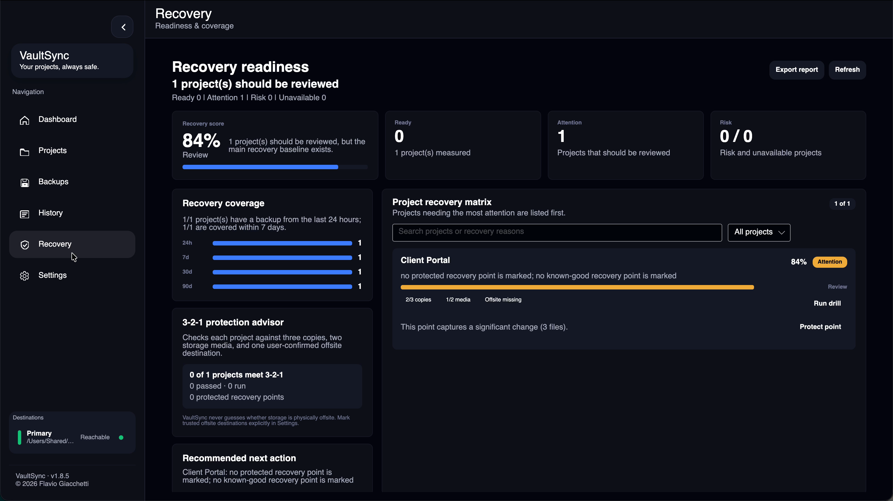
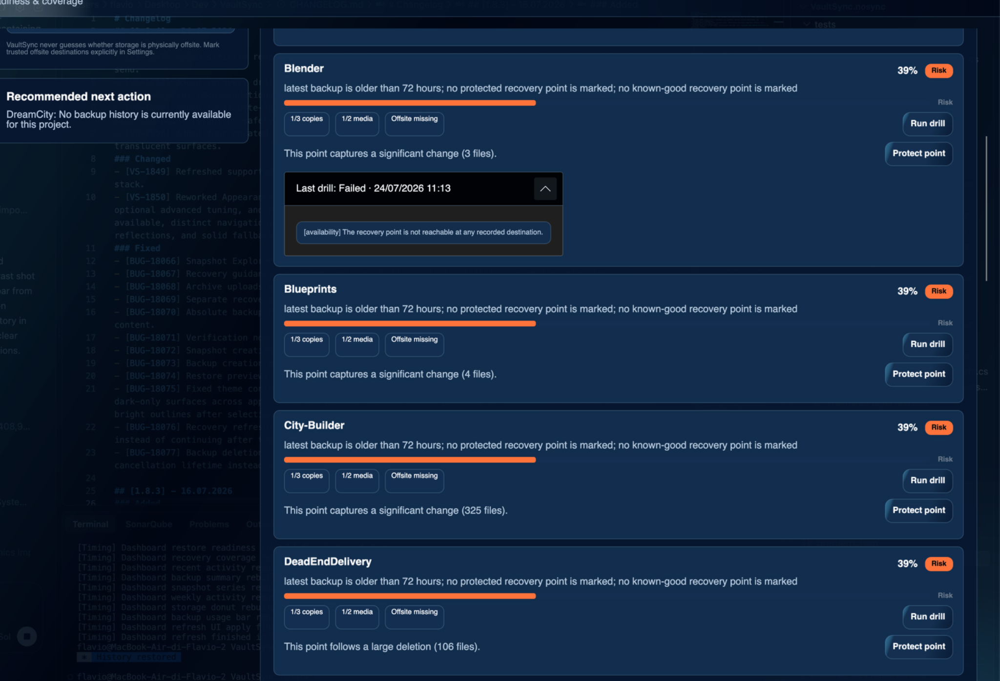

# Disaster recovery in VaultSync

VaultSync provides local, explainable disaster-recovery checks. It does not
upload backup metadata, contact a hosted service, or claim that a backup is
recoverable without examining it.

## Recovery drills

A recovery drill opens the newest recorded recovery point for a project without copying files back into the project. It checks:

1. The project, backup, and snapshot records still link to one another.
2. The recorded recovery point can be found at a configured or recorded destination.
3. A folder or ZIP payload can be opened and inventoried, up to 5,000 files.
4. When a complete snapshot file count exists, the stored inventory count matches it.
5. Up to 5,000 files and 2 GiB of complete stored content match the expected snapshot SHA-256 and size.
6. A read-only original-location plan identifies identical files, potential overwrites, and newer destination conflicts.

The result is **Passed**, **Attention**, or **Failed** and is stored in the local
VaultSync SQLite database. The Recovery page exposes the latest result and
expandable evidence. The exported Recovery Evidence Package includes drill
coverage and per-check evidence in both readable Markdown and versioned JSON,
with a manifest and SHA-256 index. History is bounded to the newest 20 drills
per project, and each drill stores at most 100 warning/error evidence rows.

An encrypted recovery point is intentionally reported as limited unless it is unlocked: the drill validates that the encrypted payload and descriptor are present, but it does not request or retain a password merely to improve a score. A passed drill is evidence that the tested checks succeeded; it is not a replacement for periodically performing a real restore on important data.

Relevant implementation:

- `src/VaultSync.Core/Services/RecoveryDrillService.cs`
- `src/VaultSync.Core/Recoverability/RecoverabilityService.cs`
- `src/VaultSync.Core/Models/DisasterRecoveryModels.cs`
- `src/VaultSync.Core/Repositories/SqliteRepository.cs`
- `docs/RECOVERABILITY_ENGINE.md`

## The 3-2-1 advisor

For every project, the advisor measures:

- **3 copies:** the project source plus currently reachable recovery points on distinct recorded destinations.
- **2 media:** distinct local volumes, mounted volumes, or network authorities represented by those reachable copies.
- **1 offsite:** at least one reachable destination that the user explicitly marked as offsite.

VaultSync does not infer physical location from a path, mount name, hostname, or protocol. A NAS in the same room is not automatically offsite, and a cloud-mounted folder cannot be proven offsite from its filesystem path. Configure this in **Settings > Backups > Backup destinations > Count as offsite copy** only when you know the destination is held at a different physical location.

The advisor resolves each record only through its recorded destination identity (or an explicitly matching moved alias). Missing and disconnected payloads remain in history but do not count toward copies, media, or offsite readiness. VaultSync does not silently mount storage, read credentials, or create a backup while the Recovery page is being viewed.

Relevant implementation:

- `src/VaultSync.Core/Services/DisasterRecoveryAdvisorService.cs`
- `src/VaultSync.Core/Services/BackupContentPathResolver.cs`
- `src/VaultSync.Core/Config/AppConfig.cs`

## Protected recovery points and recommendations

Protected points use the existing History/Backups protection marker and are excluded from automatic retention cleanup. VaultSync recommends an unprotected point when it detects, in priority order:

- a release, version, delivery, final, or submission label/tag;
- a large deletion;
- high project churn;
- no protected recent baseline before cleanup or risky work.

Recommendations never protect data automatically. The user must press **Protect point**, and the same state then appears in Recovery, History, and Backups.

Automatic retention also preserves the last recovery point that passed a byte-level proof. This is a safety floor, not a permanent protection marker: when another point passes, ordinary retention can consider the older point again.

## Local data and removal

Drill history contains local database IDs, timestamps, status, counts, and human-readable check results. It contains no file content, credentials, or transmitted identifier. Deleting the associated project, snapshot, or backup removes its drill rows through SQLite foreign-key cleanup. Removing the VaultSync metadata database removes all drill history.

## Verification checklist

- Disconnect a destination and confirm the drill fails with a reachability action.
- Reconnect it and confirm a readable folder/ZIP can pass.
- Change or remove one stored file and confirm the proof reports a hash mismatch or missing object rather than passing on inventory count alone.
- Confirm an encrypted point is marked limited without prompting for a password.
- Mark exactly one destination as offsite and verify only projects with a copy there receive offsite credit.
- Protect a recommended point and confirm the recommendation disappears and retention protection is visible in History and Backups.
- Expand the latest proof and confirm its failure evidence is selectable.
- Export the Recovery Evidence Package, validate `SHA256SUMS`, and confirm its
  report and JSON include 3-2-1, protected-point, per-project, and proof-evidence
  details without raw local paths.

## Emergency recovery on another machine

1. Stop VaultSync writers that can reach the destination and make a byte-for-byte
   copy of the repository, including `.vaultsync/meta/` and SQLite sidecars.
2. Install the same or a newer VaultSync version that supports the repository
   schema. A future/unknown schema must not be downgraded or guessed.
3. Configure the copied destination locally; do not import another machine's
   full application database or credential store.
4. Preview portable metadata. Review local root-path mapping, destination
   mapping, tombstones, conflicts, and encrypted backups before applying.
5. Restore selected content to a new empty directory and compare it before
   replacing working files.

A machine-local password/keychain reference is intentionally absent from the
repository, so encrypted recovery requires the user to provide or configure the
credential on the recovery machine. A valid writer lease allows read-only
inspection only. An expired lease is not automatic permission to overwrite it;
use explicit stale takeover after confirming the previous writer is stopped.

For raw layout, version compatibility, interrupted-write handling, and manual
read-only inspection, see [Repository formats](REPOSITORY_FORMATS.md). For the
lease and merge rules, see [Cross-machine safety](CROSS_MACHINE_SAFETY.md).
