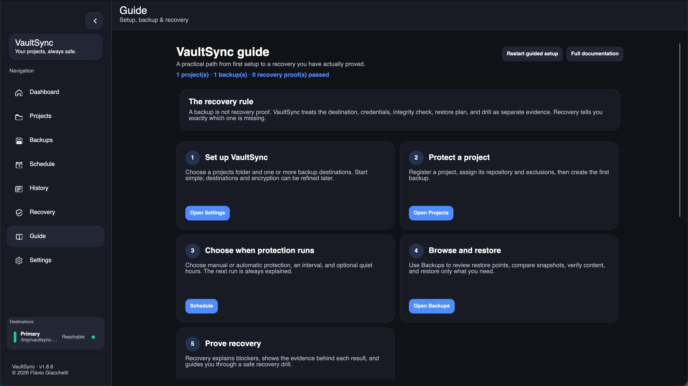
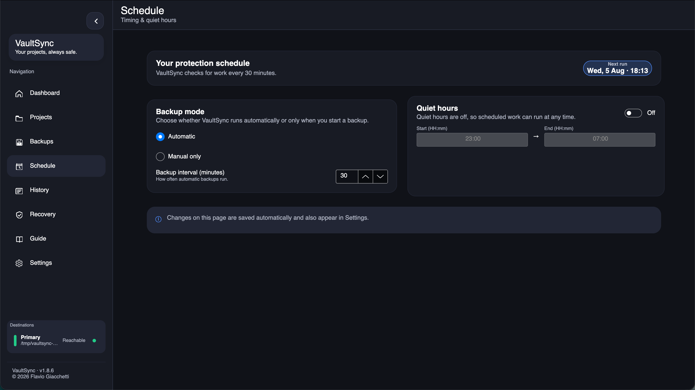
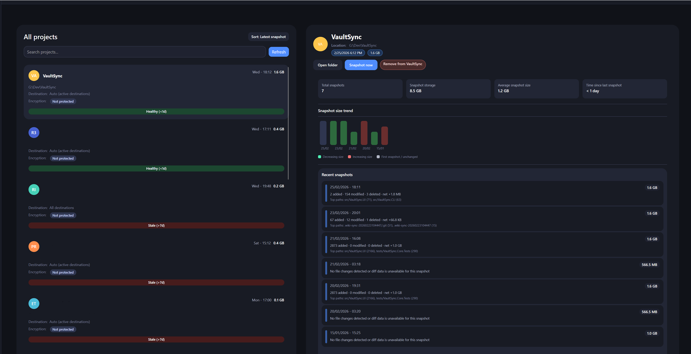
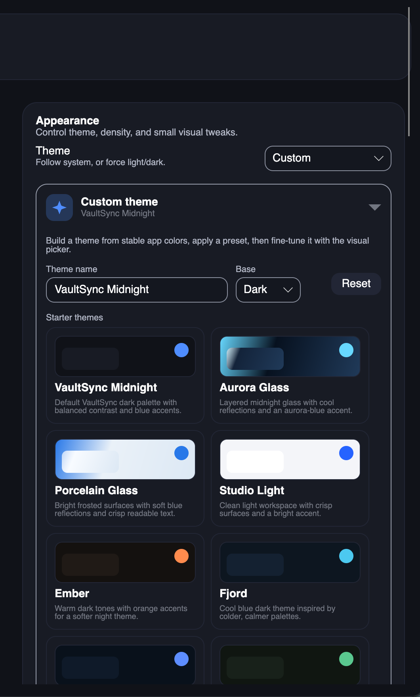
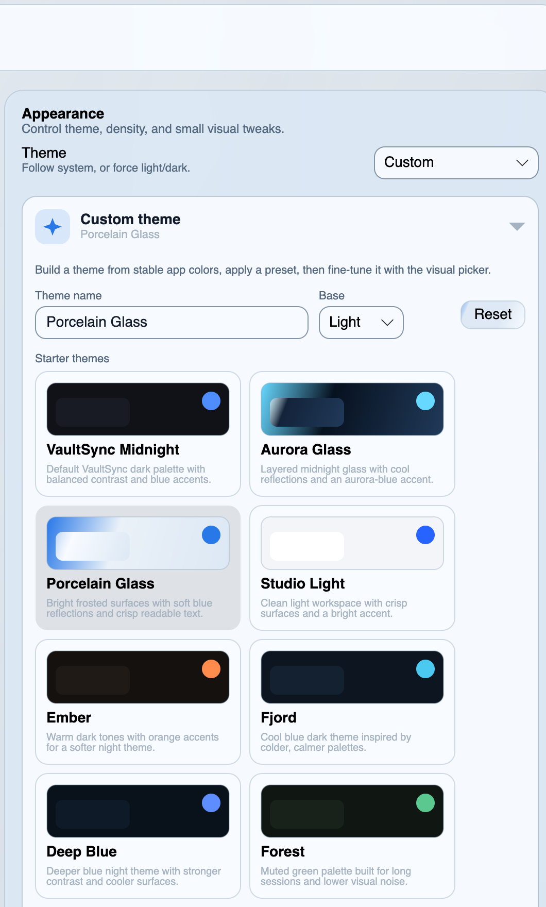
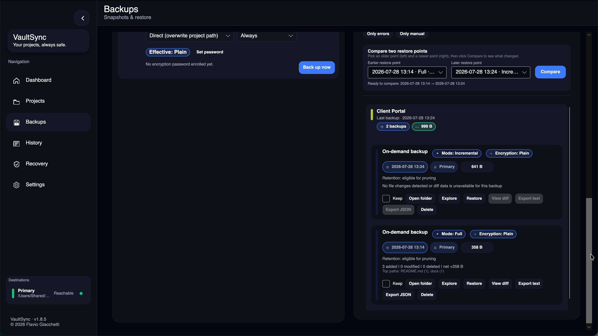

# What's New

## [1.8.8]

VaultSync `1.8.8` is the Chronicle Stabilization update. Work is beginning with
measured large-history performance, interruption and corruption recovery,
cross-platform qualification, and focused decomposition of the backup,
metadata, and desktop workflow hotspots. This section will grow only as
user-visible changes are implemented and verified.

### Safer interrupted archives
- Stop archive encryption between copied chunks when cancellation is requested,
  instead of continuing through the complete plaintext archive before stopping.
- Remove incomplete archive state after cancelled plain or encrypted compression
  while preserving the previous known-good recovery point unchanged.
- On restart, preserve only supported plain or encrypted resume checkpoints;
  discard checkpoints with an unsupported version, wrong mode, missing source
  identity, or untrusted artifact name.
- Keep retention cleanup inside the selected backup folder even when linked
  files or directories are present, and refuse a backup root that is itself a
  filesystem link without dropping its indexed restore point.
- Fail the backup if a required snapshotted source file disappears or becomes
  unreadable during archive compression or managed fallback copy, rather than
  publishing a successful restore point with missing content.
- Keep each decrypted-open temporary workspace owned by the process that created
  it, so another VaultSync instance cannot remove files being actively inspected
  during shutdown, manual lock, or stale cleanup.
- Keep abandoned-working-data cleanup inside VaultSync-owned temporary trees,
  removing linked children themselves without scanning or changing their targets.
- Remove verified release-cache writes abandoned by a crash after one day while
  preserving recent writes and unrelated hidden files.
- Remove abandoned installation-identity and credential-index writes after one
  hour without selecting durable identity, credential, or unrelated files.
- Remove sanitized support-bundle staging trees abandoned for more than one day
  while leaving completed ZIP exports and unrelated directories untouched.
- Keep recognized telemetry ZIP exports in temporary storage for up to 30 days,
  bounded to 100 MB newest-first, without selecting unrelated files.

### Lower temporary memory pressure
- Reuse one bounded buffer while adding sequential files to an archive instead
  of allocating another buffer for every source file.
- Calculate support-package manifest hashes from sequential file streams instead
  of loading each complete staged file into memory.

### Smoother guided setup
- Show progress only for real setup outcomes and let users refresh incomplete
  steps instead of leaving a disabled Next action.
- Refresh the Guide's project, backup, and recovery totals away from the UI
  thread so opening it does not pause navigation.
- Load Schedule project coverage away from the UI thread and coalesce repeated
  refreshes while settings are changing.
- Stage decrypted restore output under an unpredictable one-use name and publish
  it only after authentication succeeds.
- Keep decrypted-workspace cleanup under an exact OS temporary child even when
  another directory shares the temporary root's text prefix.
- Keep cancellation attached to the active backup when another run for the same
  project replaces an older operation.

## [1.8.7]

VaultSync `1.8.7` is the Trust and Portability update. It makes build and
recovery evidence independently checkable, protects shared repository metadata
from concurrent writers, and makes cross-machine changes explicit instead of
silently choosing a winner.

Released on 21 August 2026.

### Verifiable releases and recovery evidence
- Identify the exact running build, channel, commit, runtime, architecture,
  package type, update source, and honest signing status from Settings,
  diagnostics, support exports, recovery reports, or `vaultsync --version --json`.
- Verify every direct package against one canonical release manifest containing
  its exact size, SHA-256 digest, platform, architecture, and official URL.
- Inspect an SPDX 2.3 SBOM for each package and verify GitHub provenance online
  or from a downloaded offline attestation bundle.
- Export a portable Recovery Evidence Package with readable Markdown,
  schema-versioned JSON, a manifest, and checksums; equivalent evidence has a
  stable semantic identity and raw local paths remain redacted.
- Review an allowlisted support bundle before export, remove optional sanitized
  diagnostics or anonymized telemetry, and retain only bounded, pseudonymized,
  checksummed files with no credentials or encryption secrets.

### Safer cross-machine repositories
- Coordinate every portable-metadata writer through a repository lease with a
  durable installation identity, heartbeat, expiry, nonce-bound release, and
  explicit stale takeover evidence.
- Keep preview and read-only inspection available while another 1.8.7 client
  owns the writer lease. Clients older than 1.8.7 cannot participate and must
  not write the same destination concurrently.
- Merge independent portable project-setting edits automatically using durable
  base revisions and field provenance. Overlapping edits show Base, local, and
  imported values with writer and timestamp context.
- Keep local and Accept imported decisions remain durable and can be undone
  until the next portable repository write supersedes them.

### Reliability, privacy, and interface consistency
- Cache verified immutable update manifests across restarts instead of
  redownloading JSON on every background check.
- Bound disposable diagnostics, logs, caches, updater artifacts, and temporary
  work, while preventing an unmounted managed network path from receiving backup
  bytes on the local system drive.
- Avoid passive startup Keychain prompts and SMB mounts; credentials are read
  only for an explicit destination test or a real backup.
- Modernize Snapshot Explorer, metadata-import review, updater, Recovery
  Inspector, and optional project-folder controls with compact, theme-aware,
  translation-safe layouts.
- Standardize the canonical macOS `VaultSync.app` bundle and migrate the exact
  1.8.6 predecessor through a one-time architecture-aware bridge patch.
- Refresh the .NET 10 servicing baseline and resolve the release security,
  static-analysis, path-confinement, preset, metadata-import, and cleanup issues
  found during the 1.8.7 audit.

## [1.8.6]

VaultSync `1.8.6` is the Everyday Clarity update. It makes protection timing and background work easier to understand while strengthening the release and patch path.

Released on 10 August 2026.

### Guided setup and plain language
- Follow a compact, resumable setup sequence through source, destination, project registration, schedule, first restore point, and a passed recovery drill. The card stays out of the way and completion comes from real app state.
- Open Guide at any time for consistent definitions of backups, snapshots, restore points, verification, known-good points, protected points, and recovery drills.

### Schedule and activity
- Open the dedicated Schedule page to see whether automatic protection can run now, preview the next timer opportunities after quiet-hours deferrals, and review which projects participate and when each was last backed up.
- Use quick mode, interval, and quiet-hours edits from Schedule when planning work. They update the same saved policy as Settings; advanced retention, battery, destination, and transfer rules remain in Settings.
- Follow consistent queued, scanning, hashing, writing, verifying, waiting, and retrying states across manual and automatic backups.
- Keep post-backup hashing and verification visible independently from the primary backup operation.

### Protection overview
- Start on an action-first Dashboard that shows overall restore readiness, the project needing attention most, the next scheduled run, and the newest recovery point marked known good.
- Jump directly from each overview card to Recovery, Schedule, or History, while keeping recent activity, backup trends, and storage detail available below.

### Projects and optional folders
- Edit each project's destination, preset, exclusions, tags, encryption policy, and automatic-backup state in one place.
- Review exactly what project removal changes before confirming. VaultSync removes the local registration and history index, never the source folder or stored backup payloads.
- Organize projects into real, persistent folders instead of inferred tag views. Expand a folder to work with one project or run folder-scoped snapshot, backup, pause, and resume actions.
- Assign a project from its details. Renaming a folder preserves membership; deleting one moves its projects to Ungrouped and never deletes source files, snapshots, or backups.
- Keep folder identity visible in Schedule, Backups, Recovery, and History so the same organization follows each project through protection and recovery workflows.
- Keep unassigned projects in the normal project list. Expanded folders use the same compact cards, straight control geometry, and theme-aware surfaces as the rest of the app; collapsing a folder hides only its members.

### Safer and more accessible controls
- Primary navigation, scheduling, project, backup, recovery, and Settings controls now expose clearer screen-reader names and help.
- Reset, cache, project-index, credential, and encryption-password removal actions show their exact effects before execution.

### Release safety
- Patch installation restores replaced files and removes patch-created files when an ordinary installation failure interrupts replacement.
- Automated patch manifests name one qualified predecessor; older or unlisted installations fall back to a full installer.
- `1.8.6` ships directly as a stable release with no beta build; unpublished release-candidate artifacts use the release branch, and final assets use `Stable`.
- Rendering dependencies remain aligned across supported platforms.
- Rich-text links are limited to approved external schemes, dependency vulnerability checks are clean, and previously silent cache or deferred-backup failures now leave diagnostic evidence.

## [1.8.5]

VaultSync `1.8.5` is the Recovery Confidence update. It answers a direct question: can this project be recovered right now, what evidence supports that answer, and what should happen next?

### Recovery Confidence
- Recovery status now uses explicit, evidence-backed states instead of relying on a percentage.
- Measured checks, restore-plan simulations, inferred conditions, user-confirmed offsite status, and unsupported checks remain visibly distinct.
- Missing recovery points, unavailable destinations, missing encryption credentials, failed verification, and failed restore drills are decisive blockers that successful secondary checks cannot hide.
- Verification and drill evidence have explicit freshness windows so an old success cannot remain green indefinitely.
- Expand the Recovery Inspector to review the latest usable point, destination and credential state, verification freshness, restore-plan evidence, drill result, offsite state, decisive blocker, and next useful action.
- Run a read-only proof or restore representative files into a new isolated test folder, reopen them, verify their SHA-256 values, and retain the folder for inspection without touching the project.
- Recovery proof, test-restore, protection, and report-export events are retained in History with timestamps and source identity.
- Export a redacted, portable evidence report with application/source identity, drill and protection details, stable evidence IDs, a deterministic report ID, and SHA-256 checksum.
- First-run setup distinguishes creating a backup from proving recovery and remains resumable through the real project, backup, and drill state.

### Dependency maintenance
- SQLite and the cross-platform rendering components are refreshed and validated together as one supported baseline.
- Dependencies are removed only when their behavior is genuinely unused; intentional compatibility and security overrides remain documented when a transitive package still requires them.
- Notifications, charts, color editing, localization, secure storage, and CLI behavior remain part of the validation contract.
- macOS release packaging removes unused native architectures after publishing, reducing each architecture-specific app without mixing rendering ABIs.

### Update integrity and local privacy
- Installer downloads, patch manifests, and patch archives must match the exact size and SHA-256 digest published by GitHub before VaultSync will use them.
- Release packages include SPDX 2.3 SBOMs and GitHub provenance/SBOM attestations for the final downloadable bytes, with documented online and offline verification.
- Update URLs are restricted to the official VaultSync GitHub release path, and missing or inconsistent integrity metadata fails closed to the release page.
- Patch extraction rejects traversing, colliding, linked, oversized, or non-portable paths before replacing application files.
- On Unix-like systems, VaultSync restricts configuration, backups of configuration, and application-data roots to the current user.
- Direct desktop packages remain intentionally unsigned. Use only official release assets, compare their published SHA-256 digests, and expect Windows SmartScreen or macOS Gatekeeper to ask for confirmation.

## [1.8.4]

VaultSync `1.8.4` is the Disaster Recovery update. It adds byte-level recovery proofs, transparent 3-2-1 guidance, protected-point recommendations, and a privacy-first crash-report workflow.

### Themes and appearance
- Choose from four new curated themes: Aurora Glass, Porcelain Glass, Paper & Ink, and Neon Dusk.
- Glass presets request platform acrylic or blur when available, then layer adaptive tint, reflected highlights, ambient color, and soft separation over a predictable cross-platform fallback.
- Aurora Glass uses cool midnight depth and restrained cyan reflections; Porcelain Glass uses brighter frosted navigation with more opaque content surfaces for dependable dark-text contrast.
- Preview themes visually before applying them, collapse the theme studio when it is not needed, and open advanced color tuning only when you want it.
- Custom theme files retain their rendering style, while older configurations continue to load as solid themes.
- Text contrast is checked across every custom-theme surface, while status colors, navigation, History, Recovery, and code previews remain readable in light or dark palettes.

  
  

### Disaster recovery
- Run a non-destructive proof against a project's newest recovery point without copying anything into the project.
- Verify the complete stored bytes and sizes of bounded folder or ZIP contents against the SHA-256 values captured by the selected snapshot.
- See stable evidence for missing, unreadable, corrupted, inconclusive, verified, and destination-conflict outcomes; encrypted content is never described as verified while locked.
- Simulate safe-copy or original-location restore actions without creating, overwriting, or deleting files.
- Expand the latest evidence in Recovery and include the check codes, paths, evidence IDs, and results in the exported Markdown report.
- Keep the last byte-verified point out of automatic retention pruning until another verified point exists.
- Measure three copies, two storage media, and one explicitly confirmed offsite destination per project.
- Mark destinations as offsite yourself; VaultSync does not infer physical location from paths or network protocols.
- Protect suggested release, delivery, post-deletion, high-churn, or baseline recovery points without creating a second protection system.
- Only recovery points that are currently reachable at their recorded destination count toward 3-2-1 readiness; disconnected or missing copies remain visible but cannot create a false protection score.

### Reliability and safety
- Snapshot Explorer refuses linked source entries and ambiguous duplicate ZIP paths before browsing, comparing, or restoring them.
- Absolute backup records cannot escape their recorded destination, and verification cannot follow imported traversal or linked paths outside its root.
- Backup creation rejects untrusted snapshot paths before reading source bytes or creating destination files; restore previews and selective restores preserve case-distinct identities.
- Archive-upload progress workers now stop promptly after completion or failure, stalled uploads retain checkpoint retry behavior, and prematurely ended source chunks fail closed.
- Recoverable UI exceptions continue to enter the local review workflow throughout the session instead of only after the first event.
- Supported SQLite, protected-data, and Windows drawing packages include their latest safe servicing updates; the rendering stack remains on its validated coordinated versions.

### Privacy-first crash reports
- Crash assistance creates a minimal, strictly allowlisted report locally and never uploads or sends it automatically.
- Every report receives a category-prefixed UUID generated for that report only; it is not a user, device, installation, or tracking ID.
- The exact generated report is shown in a read-only view. Its report ID, operating-system family, crash category, and exception-type reason cannot be changed in VaultSync.
- Exception messages, raw logs, paths, file content, project and backup names, credentials, configuration, detailed OS information, and user or machine identifiers are excluded.
- Preparing a report opens a visible email draft with the reviewed report already attached. The user must inspect the message and attachment and press Send in their own email application; attachment failures fall back visibly to the local report folder.
- Crash assistance can be disabled completely in Settings. Local reports are limited to ten files and seven days, with owner-only permissions requested on Unix-like systems.

## [1.8.3]

VaultSync `1.8.3` introduces Compare & Change Intelligence with searchable file-level changes and safe, line-by-line text comparisons, while strengthening release safety and diagnostics retention.

The comparison workflow now uses clear earlier/later restore-point choices, compact affected-path and changed-file review, plain-language result states, and keyboard-accessible vector controls. Dashboard activity and storage cards also adapt to narrow windows instead of crowding fixed multi-column layouts.

### Compare & Change Intelligence
- Backups can compare any two restore points from the same project using their stored snapshot file inventories.
- The comparison shows added, modified, deleted, and unchanged files with per-file size deltas and changed-path hotspots.
- Large deletion, significant growth, and high-churn signals call attention to unusual project changes.
- Changed files can be searched and filtered by added, modified, or deleted state; selecting readable content opens a compact red/green comparison with old and new line numbers.
- File inventory loading and comparison run away from the UI thread, and both file-list and text previews are capped safely for large histories.
- Comparison QoL suggests the nearest valid restore point, explains invalid selections, supports cancellation, and clearly reports empty, filtered, and capped result states.

### Diagnostics and reliability
- Diagnostics cleanup now runs at startup and every six hours on Windows, macOS, and Linux.
- VaultSync keeps at most two hang dumps within a 1 GiB total diagnostics budget.
- Hang capture uses smaller mini dumps, stops after 20 seconds, and removes timed-out partial output.

### Language support
- VaultSync is now available in Indonesian, Japanese, Korean, Dutch, Polish, Turkish, Ukrainian, and Vietnamese.
- Localization validation now prevents missing or duplicate keys, empty values, broken format placeholders, and locale files that are shipped without being registered in the app.

### Release and maintainability
- The desktop UI now runs on Avalonia 12.1 with compiled bindings, updated focus/selection behavior, modern placeholder and window-decoration APIs, and an aligned cross-platform rendering stack.
- Dashboard, Projects, Settings, Backups, and the snapshot compare workspace now use compile-time checked bindings; large backup histories render incrementally instead of constructing every card at once.
- Async UI actions reject accidental re-entry, observe failures, and cancel Recovery refresh work when its page detaches.
- Nullable warnings are no longer globally hidden, so warning-as-error builds enforce the complete null-safety baseline.
- macOS credentials use the native Security framework, Linux credential helpers have real timeouts, and the credential index is written atomically with restricted permissions.
- Metadata synchronization coordinates independently per destination and no longer depends on mutable global presentation callbacks.
- Release packaging now requires build, test, and vulnerability gates; macOS has CI coverage; pinned AppImageKit tooling is checksum-verified; missing required artifacts fail the workflow.
- Release scripts validate output paths before writing patch and download-stat artifacts.
- Snapshot, Snapshot Explorer, CLI, Projects, and Settings workflows are split into smaller focused helpers.
- Additional Sonar analyzer findings and repeated service/UI literals have been cleaned up without changing public behavior.

## [1.8.2]

VaultSync `1.8.2` starts the Snapshot Explorer release slice for finding files before a full restore.

### Snapshot Explorer
- Backup cards now include an Explore action for browsing folder and archive backups.
- Snapshot Explorer supports folder navigation, file search, metadata, and text preview for common readable formats.
- Individual files or folders can be restored from the explorer while keeping restore paths root-bound.
- Encrypted backups are detected and routed to the normal restore flow; encrypted archive browsing remains outside Snapshot Explorer v1.

## [1.8.1]

VaultSync `1.8.1` continues Recovery Intelligence while hardening encrypted backups, credentials, and Linux updates.

### Recovery Intelligence
- Recovery can export a portable Markdown report with readiness, coverage windows, recommendations, and project status.
- The Recovery project matrix can be searched and filtered to ready projects or projects needing attention.

### Linux updates
- VaultSync now prevents multiple Linux UI instances with a process-lifetime file lock and activates the existing window on repeated launches.
- Protected `.deb` installations run elevated patch application without depending on a root-owned graphical desktop session.
- Full `.deb` fallback installs explicitly reinstall the downloaded package when repair is required.

### Encryption and credentials
- Encrypted archives are completed locally before upload, so destinations no longer receive a plaintext archive first.
- Linux credential entries are isolated by key reference for reliable save, lookup, cleanup, and deletion.
- Encrypted archive metadata is bounded and validated before expensive key derivation or plaintext output begins.
- Interrupted encryption and failed authentication clean up partial plaintext and encrypted artifacts more consistently.
- A new backup encryption guide explains setup, password storage, backup creation, opening, restore, and password rotation.

## [1.8.0]

VaultSync `1.8.0` introduces Project History and Recovery Intelligence, with editable recovery-point context and readiness guidance.

### Project History
- History now has a dedicated navigation entry and reads real backup, snapshot, restore, and metadata activity.
- The History workspace provides timeline and compact views with project, activity, lane, date, and text filtering.
- Important snapshots can be labeled, documented, tagged, protected from cleanup, and marked as known-good recovery points.
- Protection state is shared with the Backups page, so History markers, Backups “Keep,” and retention decisions remain consistent.
- Successful restores are recorded alongside backup and metadata activity.

### Recovery
- Recovery now has a dedicated navigation entry and shows readiness, coverage, and project priority data from the local repository.
- Recovery rows are ordered by attention needed so the weakest restore baseline is visible first.
- Dashboard readiness and attention widgets link directly into History, Recovery, and Backups workflows.

### Foundation
- Snapshot Explorer, advanced compare intelligence, disaster-recovery drills, and project groups remain planned for later `1.8.x` releases.

## [1.7.5]

Current `1.7.5` highlights focus on making the codebase more reusable and maintainable while tightening metadata-import performance diagnostics.

### Architecture and maintainability
- Package versions now live in one central props file instead of being repeated across projects.
- Configuration access, runtime logging, hash formatting, byte-size formatting, and common test setup now use shared helpers.
- UI repository lookups now use the shared config-store database path resolver instead of repeating fallback logic.
- UI repository creation and selected background fire-and-forget work now go through shared helpers for easier testing and diagnostics.
- View models reuse common property-notification helpers, reducing repeated UI plumbing.
- Projects and Settings helper view models now live in focused files, making the main view-model files easier to scan.
- Backups helper view models now live in a focused companion file, further shrinking the main Backups view model.
- Metadata tombstone export paths and Backups option-selection helpers now share common plumbing instead of repeating the same write/update blocks.
- GitHub issue templates now collect clearer bug, crash, beta, backup/restore, update/install, and feature request details.
- Settings reload notifications and backup archive test setup now use named helpers instead of repeated inline plumbing.
- Release templates, Store validation docs, and metadata/snapshot test temp directories now have clearer stable-release cleanup.
- Core tests use shared temporary directory, config, repository, and builder fixtures.
- Small, primary, and banner action buttons now share the same alignment rules across shell, widget, Backups, Projects, and Settings surfaces.
- The build now reports unused exception-variable warnings again after the 1.7.5 cleanup pass removed the low-risk unused catch variables.
- Credential profile cards in Settings now keep password visibility controls inside the card instead of clipping them at the edge.

### Performance and diagnostics
- Dashboard refresh work now has verbose timing around data load, dispatcher wait, and individual rebuild phases.
- Recent activity projection reuses a project lookup instead of scanning projects per activity row.
- Background metadata auto-imports remember successful unchanged sources and can skip repeated imports when the remote store files have not changed.
- The unchanged-source cache now checks local repository coverage before skipping, so recreated databases or newly reachable backup folders still reconcile.
- The unchanged-source cache now verifies source external IDs instead of trusting local row counts, so unrelated history cannot hide missing imported metadata.
- Metadata import internals now report phase timings for temp-copy, row reads, backup apply, legacy folder scan, and restore flag updates.
- Main SQLite repository connections now use escaped connection-string construction, busy timeouts, and less lock-prone connection handling.
- SQLite schema startup code is split into clearer setup phases and avoids reopening the database for each column migration.
- Windows notification failures and manual storage-health rechecks now stay quieter and keep UI updates on the UI thread.
- Config fallback now records when VaultSync recovers from a broken primary config through the backup or last-known-good snapshot.
- macOS tray Quit now closes VaultSync cleanly without the native menu teardown crash seen when quitting from the status-bar menu.

### Linux updates and shutdown
- Protected Linux installs still fall back to installer updates when patching cannot safely write to the app folder, but Debian-family systems now hand the downloaded `.deb` directly to the OS elevation prompt instead of leaving users in the graphical app manager.
- Linux shutdown and logout requests now bypass the tray background-close behavior, so VaultSync does not hide to tray and interrupt power-off.
- Linux shutdown signals are now recorded in diagnostics to make future desktop-session issues easier to confirm.
- Linux tray icon teardown now clears the native menu and delays immediate AppIndicator recreation, reducing duplicate tray indicators after rapid toggles, shutdown, or update relaunches.

### Cross-machine backup history
- Imported backup history from another machine no longer becomes the baseline for new local snapshot diffs.
- Project backup deltas now compare only matching local/imported, origin-machine, and destination scopes, so alternating Windows/Linux metadata no longer appears as huge add/remove swings.
- Backup size metadata is now documented as logical source size represented by the snapshot, not guaranteed physical storage consumed on disk.

### Cleanup
- Destination path normalization and NetworkMount diagnostics now reuse common helpers.
- The 1.7.5 changelog records the cleanup work as versioned release notes.

### Presets and generated output
- Development and creative presets now exclude nested generated outputs such as build, cache, import, and render folders.
- Filter coverage now includes nested `**/bin/**`, `**/Intermediate/**`, `.import`, and render-cache style folders.
- Source-code presets keep `.github` workflows, Git control files, and shareable
  editor settings while excluding live `.git` internals, generated build output,
  and machine-local caches.

## [1.7.4]

Current `1.7.4` highlights focus on Linux packaging/update polish, project reliability fixes, and small UI corrections.

### Linux and release assets
- Linux protected installs such as `/opt/vaultsync` now use the installer fallback instead of attempting a patch update that cannot write to root-owned files, and release asset builds can omit Linux patch assets when an installer-only Linux update is required.
- Linux updater fallback now prefers `.deb` installers on Debian-family systems and marks downloaded AppImages executable before launch.
- Linux startup now keeps Avalonia's compatible DBus protocol dependency instead of overriding it with an incompatible newer package.
- Linux packages now use one AppStream, desktop, icon, and window identity to improve software-center previews and avoid duplicate taskbar grouping.

### Project and UI fixes
- Project preset changes now persist immediately for registered projects instead of reverting after refresh.
- Projects now call out latest snapshot size explicitly and show unavailable size data instead of misleading `0 MB` values.
- The sidebar collapse control now uses a vector icon so Linux desktops no longer render it as a missing-glyph rectangle.
- Projects list scrolling now keeps ListBox virtualization active, and sidebar navigation labels align cleanly with their icons.
- Project snapshot presets now stay populated by applying detected recommendations first and falling back to a generic preset when no specific project type is detected.

## [1.7.3]

Current `1.7.3` highlights focus on Linux reliability, release asset coverage, safer startup/config recovery, and the final backup and metadata fixes from the 1.7 stabilization cycle.

### Linux and release assets
- Release asset builds now produce Linux `tar.gz` and `.deb` downloads for `x64` and `arm64`.
- Release asset builds also produce a desktop-friendly `linux-x64` AppImage for direct Linux installs.
- Linux `tar.gz` downloads include a rootless `install.sh` that adds VaultSync to the user app menu and creates a `vaultsync` terminal command across distro families.
- Linux update discovery now prefers architecture-specific installer and patch names before falling back to generic Linux assets.

### Linux reliability fixes
- Tray panel screen detection, reopen behavior, and Linux/Wayland positioning are more resilient on Hyprland-class environments.
- Tooltip flicker and focus issues on Linux/Wayland were fixed by enabling overlay popups.
- A fatal Linux x64 `AccessViolationException` during backup was fixed.
- Linux password saving no longer stores `null`, and password operation timeouts are longer.

### Settings and startup recovery
- Settings now refreshes persisted values correctly after config reloads, so fields such as Projects root no longer appear blank when the saved config is intact.
- Startup can repair blank project root paths from the configured Projects root when the matching folder still exists on disk.
- Background settings saves preserve existing project roots, backup roots, and advanced destinations when the UI is still loading transient blank values.
- Command state refreshes now marshal back to Avalonia's UI thread, preventing startup/background checks from crashing command validation.

### Backup and metadata reliability
- Backup All and auto-backup no-change runs now create real first backup artifacts instead of empty destination folders.
- Individual project backup buttons resolve destinations from the latest saved config and refresh destination choices after backup destination settings change.
- Metadata imports compare restore-needed state against the pre-import local backup baseline so newly imported backups no longer suppress their own restore prompt.
- Project auto-backup settings export through metadata before the first backup, so toggles travel across machines earlier.

### Usability
- The in-app log console now has an explicit Auto-scroll toggle.
- The in-app log console can copy the selected log line with a button or the usual platform copy shortcut.

## [1.7.0]

Current `1.7` release-train highlights, including repair tooling, safer updates, transfer resilience, dashboard clarity, and in-context appearance customization.

### Integrity and repair
- Added startup backup-index consistency checks so VaultSync can detect metadata drift early without blocking launch.
- Added deterministic backup-index repair planning plus a Doctor workflow for dry-run and exact fix-now actions.
- Added retention chain preflight and safer retention delete planning so cleanup does not remove the last metadata-valid restore point.
- Added cross-machine metadata conflict capture and resolution for project destination, restore mode, verification policy, and tags.

### Transfer resilience and storage
- Added destination quotas and cleanup suggestions in Backups.
- Added checkpointed archive retry so interrupted archive uploads can resume from validated checkpoints instead of always restarting.
- Added retention simulation preview in Settings.
- Added restore-readiness scorecards in Dashboard and Backups.

### Updates and serviceability
- Added updater release-target diagnostics, patch preflight diagnostics, and richer support-bundle telemetry.
- Added a release-readiness gate script for pre-publish and post-publish verification.
- Added strict multi-base patch manifest support so one patch manifest can safely allow multiple exact tested base versions.

### UI and workflow improvements
- Redesigned the Dashboard information layout for clearer KPI, activity, storage, and readiness scanning.
- Added app-wide tag color styling and in-Projects tag color editing.
- Added custom theme presets, quick palettes, and slot-based theme editing in Settings > Appearance.
- Improved Projects empty-state and no-selection behavior instead of rendering broken blank detail panes.

### Fixes
- Fixed Projects root persistence across restart/config race conditions.
- Fixed Doctor workflow command-state updates crossing onto invalid threads.
- Fixed noisy backup/restore/dashboard trace chatter so normal runs stay clean unless verbose logging is enabled.
- Fixed theme saves so they no longer overwrite tag colors managed from Projects.
- Restored corrupted bundled font assets used by the UI.

## [1.6.0]

### Restore and backup workflow
- Added per-project restore mode (`Direct`, `Sandbox`) with a restore-time override.
- Added sandbox completion actions (`Keep`, `Open sandbox`, `Apply to project`) and apply preflight summary/confirmation.
- Added plain-backup restore preview and selective top-level restore targets.
- Added restore-point timeline compare (`A`/`B`) with range/size/net-diff summary.

### Projects and presets
- Added project tags persistence, pill editing, reusable tag suggestions, and smart groups (`Work`, `Games`, `Media`, `Critical`, `Archive`).
- Added group actions in Projects (snapshot, backup, auto-backup toggles, apply/remove by tag).
- Added preset recommendation engine for common stacks and improved confidence gating.
- Added in-app preset rules editor with reload/test/save plus clone/import/export actions.

### Reliability, diagnostics, and storage insights
- Added support bundle export (`Settings > Advanced`) with redacted config, diagnostics, and telemetry summaries.
- Added per-destination retry policy settings and destination-scoped retry execution with backoff/telemetry.
- Added per-project verification policy (`always`, `scheduled`, `manual`).
- Added backup storage deltas and top-storage-consumer insights in Backups/Dashboard.

### Fixes and hardening
- Fixed major windowed-mode layout/overflow issues across Backups, Projects, Dashboard, and Settings.
- Fixed backup path-containment validation across delete/retention/restore/open-folder flows.
- Hardened elevated patch validation (request path checks + payload/archive integrity checks).
- Fixed project tag input command startup binding noise in diagnostics logs.

### Updates
- Release notes are available in the app. [Release notes](https://github.com/ATAC-Helicopter/VaultSync/releases)
