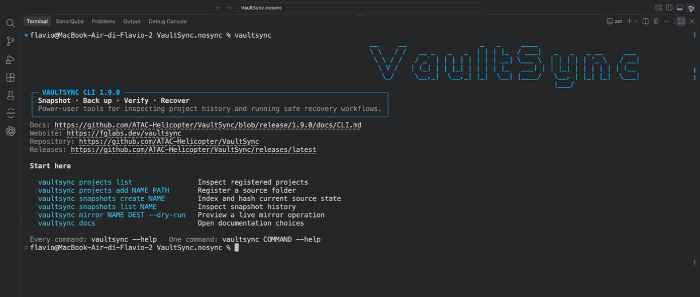
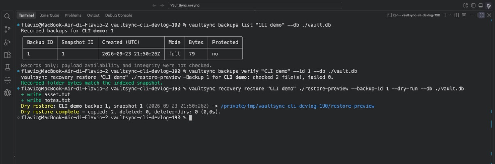
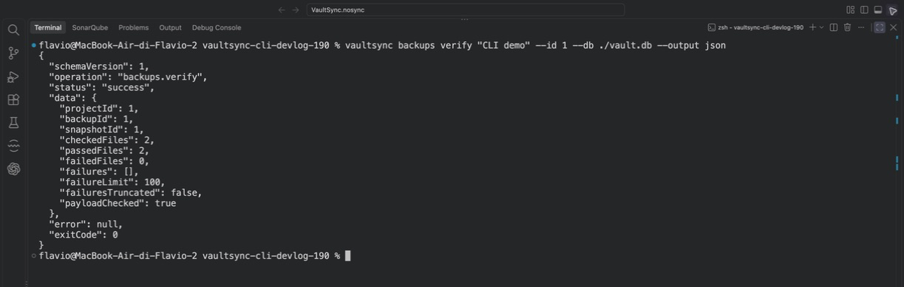

# VaultSync 1.9 dev update — making the CLI worth opening

Published: 2026-09-24
Status: 1.9 development branch, draft PR #683
Website: https://fglabs.dev/devlog/vaultsync-19-cli-worth-opening

A backup CLI can have a long command list and still be something nobody wants to open. That was the uncomfortable part of looking at VaultSync's older terminal workflow. The commands existed, but it was too easy to confuse a live mirror, a snapshot of the source, and a recorded backup you could actually restore.

For 1.9, I want the terminal to be a useful companion to the desktop app: clear enough when you are exploring, predictable enough when you are writing a script, and honest about what has been checked.

## Start with a map

Opening `vaultsync` now shows a small introduction, the first commands to try, and direct links to the website, repository, releases, and full CLI documentation. The handbook, task guides, and an exhaustive command reference are bundled with the CLI, so `vaultsync docs --full` works even when you are offline. There are Bash, Zsh, and PowerShell completion scripts too.

It is a little bit of visual polish, but the more useful part is that the tool tells you where to go next instead of greeting you with a wall of flags.

## A backup, not just a mirror

The 1.9 development branch now has a recorded folder-backup path from the CLI. You can create a backup at an explicit destination, inspect its record, verify the stored bytes against the indexed hashes, and preview a restore. The creation command uses VaultSync's shared backup service and builds a full-hash snapshot first. A dry run checks the plan without creating a backup.

Here is the real CLI running against two disposable files on my machine:

The distinction in that screen matters. `backups list` reports a record; it does **not** claim that the bytes are still present. `backups verify` checks those stored files. `recovery restore --dry-run` shows what would be copied before touching the target. The restore command can also select a specific backup and repeated file or folder paths when you only need part of it.

A live `mirror` is still useful, and it now has a name that says what it does. It transfers today's source state. It does not quietly turn into a recorded recovery point because the command succeeded.

## Results a script can read

For terminal-heavy workflows, pretty output is not enough. The new opt-in `--output json` mode returns a versioned result with an operation, status, data or error, and an exit code. Backup verification includes checked and failed counts, with bounded failure details. Preview and live results are distinguishable. The existing command aliases and older `--json` payloads remain available during the compatibility window.

This work has also exposed less photogenic bugs. I fixed quiet commands leaking service diagnostics into stdout, a restore path that needed to recheck staged bytes before replacing a target, and a live prune command that printed a human success line after its JSON. A script should not need to guess where the JSON ends and the celebration begins.

## Where 1.9 stands

This is development work in [draft PR #683](https://github.com/ATAC-Helicopter/VaultSync/pull/683), **not a 1.9 release**. The current branch passed 1,024 local .NET tests, 111 script tests, generated documentation and completion checks, and a Release CLI package build. Hosted platform checks have not run on this head because Actions minutes are exhausted. Windows, macOS, and Linux qualification still matters before release.

There are real boundaries today: the new CLI creation and restore path covers supported folder backups, not encrypted or archive restore parity. Cross-project bulk mutation and the remaining unattended-output contracts are still open. Disk imaging and bootable recovery are separate 1.9 release gates, not features I am claiming from these screenshots.

The CLI is finally becoming something I would reach for when I need to inspect a backup quickly, check stored bytes, or preview a recovery from a terminal. That is a better milestone than making the help output longer.

**What would make you trust a backup CLI more: a clear restore preview, machine-readable verification evidence, or a better way to check many backups at once?**
