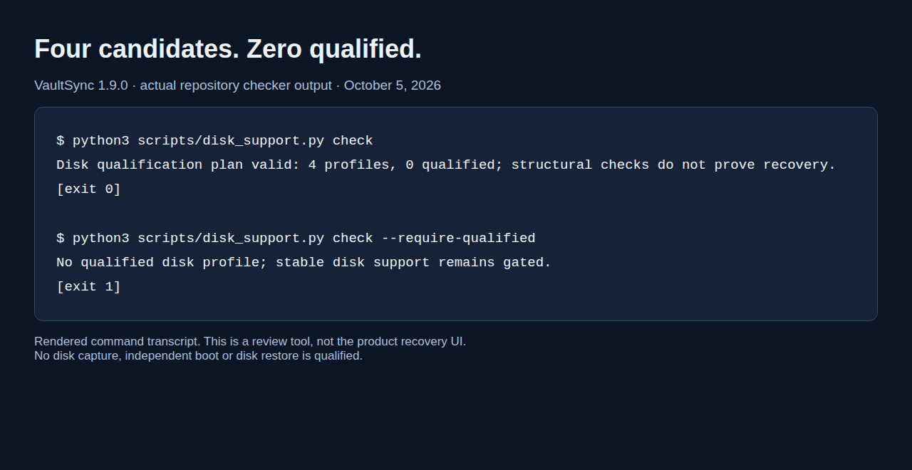

# VaultSync 1.9.0 dev update — when a green check is not recovery

A backup tool can pass every build and still have no evidence that it will bring a machine back. That is an awkward sentence to put in a dev update. It is also the useful part of this week's VaultSync work.

The new disk-qualification checker currently prints **four profiles, zero qualified**. That is the expected result. The interesting change is that the support plan now has executable rules behind it, rather than a table that can become reassuring by accident.



## Two checks, two different answers

Here is output from the actual repository checker on October 5:

```text
$ python3 scripts/disk_support.py check
Disk qualification plan valid: 4 profiles, 0 qualified; structural checks do not prove recovery.
[exit 0]

$ python3 scripts/disk_support.py check --require-qualified
No qualified disk profile; stable disk support remains gated.
[exit 1]
```

The first command checks whether the plan and its evidence references are structurally consistent. The second also requires a qualified profile. A well-formed plan passes; a claim of supported disk recovery does not. The red result is doing its job. I have resisted the very efficient engineering technique of changing the answer until it becomes green.

## What has to belong to the same recovery run

The required loop is **Capture → Validate image → Boot → Restore → Validate restored system**. Reports must refer to the same run, image content root, capture build, recovery build, profile and environment. Their timestamps must follow the stage order, and retained artifacts must match their SHA-256 hashes.

That prevents a successful capture from one experiment, a boot from another machine, and an unrelated restore from being assembled into one happy story. Simulation and user confirmation do not qualify as measured execution. A VM result does not become physical-hardware coverage.

Today I found and fixed another gap: the checker accepted a run whose capture happened before the retained engine approval. It now rejects that chronology and refuses to count profiles with invalid approval artifacts. Two additional regression tests cover those cases; the repository's **124 Python tests pass locally**, alongside family, metadata, changelog and disk-plan checks. The synthetic test reports exercise the checker only. They are never added to the support matrix.

There is still a human boundary here. Hashes detect changed artifacts; they cannot prove that somebody really booted a restored machine. Evidence review remains necessary.

## A smaller first proposal

The engine ADR proposes full raw imaging from an independent Linux x64 offline recovery environment. The four candidate source profiles are GPT/UEFI Linux ext4 and Windows NTFS, each with 512-byte or 4096-byte logical sectors. Copying the full disk makes the initial byte-coverage model simpler, but also copies unused space and needs storage for the source's full capacity.

Live capture, Secure Boot, encryption, macOS/APFS disk recovery, multi-disk layouts and other unsupported geometries remain outside that first proposal. These are proposed boundaries awaiting review, not newly supported systems. No imaging engine, privileged device worker or boot medium has been implemented.

## Where the earlier CLI work went

Since the last update, the roadmap has been split into explicit release ownership. **1.9.0 comes first**, focused on disk and bootable recovery foundations. Discovery and completion belong to **1.9.1**; the resource-oriented CLI automation shown in earlier development posts belongs to **1.9.5**. That work is preserved in its own preparation branch. It is not all shipping in the 1.9.0 binary.

The current assembled 1.9.0 review is [draft PR #736](https://github.com/ATAC-Helicopter/VaultSync/pull/736). At the audited October 4 head, platform build/test and release-profile checks passed; Sonar failed while retrieving the PR. Today's checker fix has local validation, and remote checks on its new commit are a separate result. The Linux startup investigation also remains open; a running process does not establish a usable desktop window.

**Stable is still 1.8.9. VaultSync 1.9.0 has not shipped, and disk recovery remains unimplemented and unqualified.** Next comes joint architecture approval, then implementation and actual recovery runs—not changing the support count by hand.

If you have had to restore a whole machine, what failed after the image itself verified: boot, finding the destination disk, unlocking it, or getting your applications back into a usable state?

Sources: [engine proposal](https://github.com/ATAC-Helicopter/VaultSync/blob/work/1.9-roadmap-realignment/docs/adr/001-imaging-engine-1.9.md), [qualification matrix](https://github.com/ATAC-Helicopter/VaultSync/blob/work/1.9-roadmap-realignment/release/disk-support-1.9.0.json), [release contract](https://github.com/ATAC-Helicopter/VaultSync/blob/work/1.9-roadmap-realignment/docs/RELEASE_1.9.0.md).
