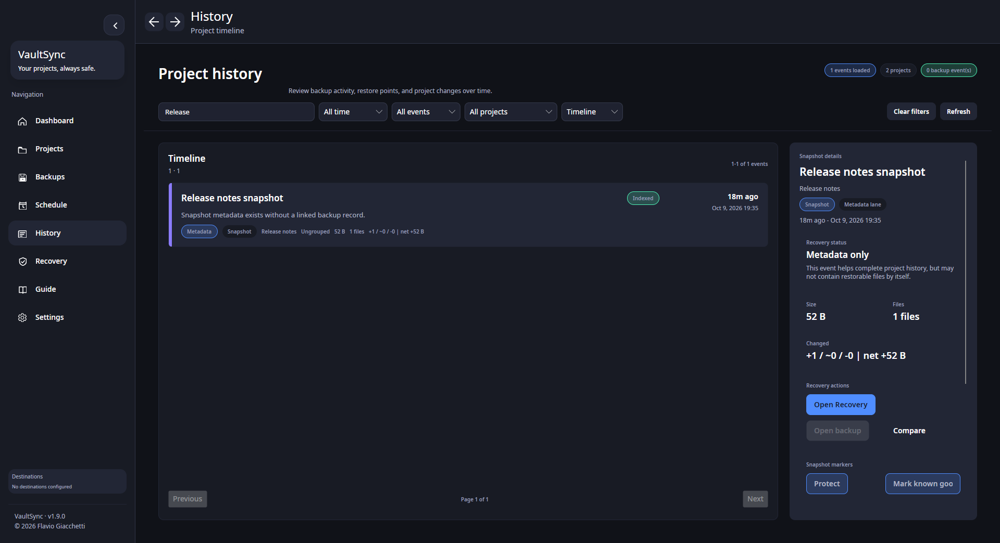
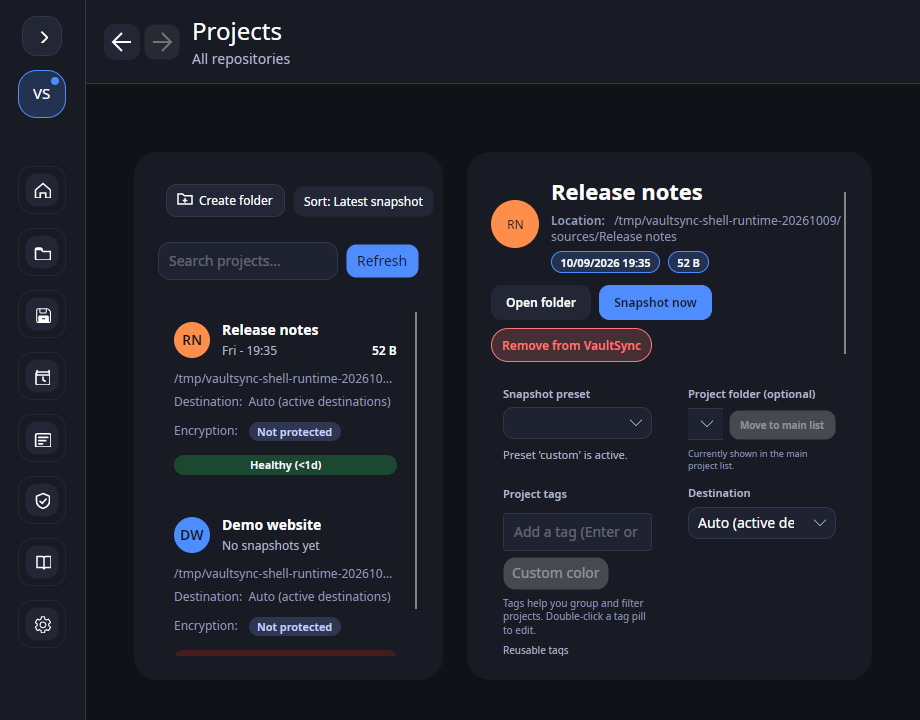

# VaultSync 1.9.0 dev update — keeping your place

**Draft for publication review. VaultSync 1.9.0 has not shipped.**

Most of the recent 1.9.0 work has been foundations: deciding what a recovery
image must prove and keeping unsupported combinations explicit. This time there
is also something to click.

The development shell now has Back and Forward buttons beside the page title,
plus **Alt+Left** and **Alt+Right**. They move through the pages visited in the
current session. Going back and then opening another page starts a new branch;
restarting resumes the saved last page rather than replaying the whole history.

## A small button found several real problems

The useful test was not whether an arrow appeared. It was whether I could leave
History, open Settings, return and still find the same filter and unfinished work.

That exposed a draft-loss bug. Refresh rebuilt the timeline rows, the list briefly
cleared its selection, and unfinished snapshot labels, notes and tags disappeared.
The refresh now preserves drafts for the same project and snapshot. Selecting a
different snapshot loads that snapshot's metadata, and drafts remain local to
the running session.

Two other fixes protect the next startup. Saved-page restoration now happens
before a delayed callback can redirect the user's first navigation. Last-page
writes are ordered and intermediate queued visits are coalesced, so a slow save
cannot leave an older page as the location to resume.

The narrow-window check also caught snapshot statistics crowding out project
names. Those card headers now use two lines, including projects with no snapshot.

## Where this fits in 1.9.0

This is the first page-navigation increment under **VS-1910**, on the existing
shell. It is not the complete Protect/History/Recover/Manage redesign. Linux
native checks cover the recorded toolbar, keyboard, filter and draft scenarios;
the complete platform and accessibility matrix remains open.

The screenshots use two synthetic projects and a real metadata snapshot of a
tiny fixture file. There is no stored backup payload or disk image in that demo;
History correctly calls it **Metadata only**. Disk capture, independent boot
media and disk restore still need implementation and measured qualification.
**Stable remains 1.8.9.**

The code, regressions, screenshots and limits are tracked in
[PR #736](https://github.com/ATAC-Helicopter/VaultSync/pull/736) and the
[navigation evidence](../release-evidence/1.9-navigation-2026-10-09.md).

When moving between backup history and settings, which bit of context matters
most to you: the selected recovery point, filters, unfinished notes, or scroll position?
