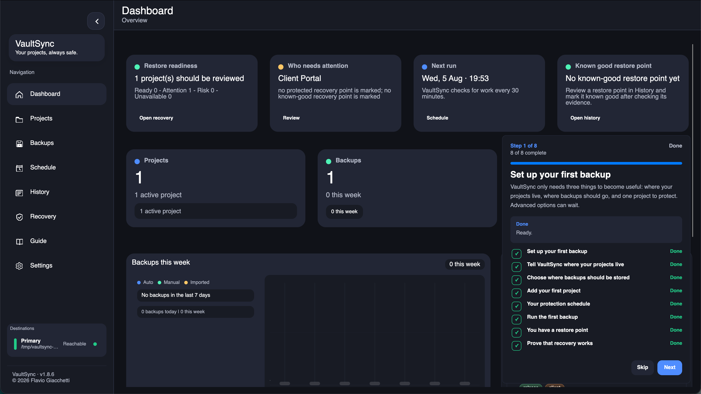
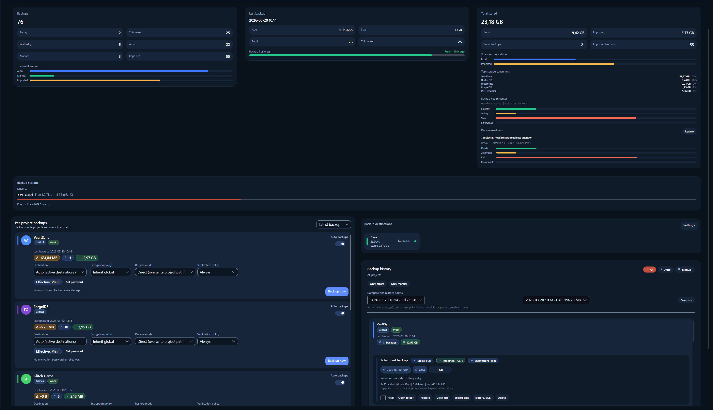
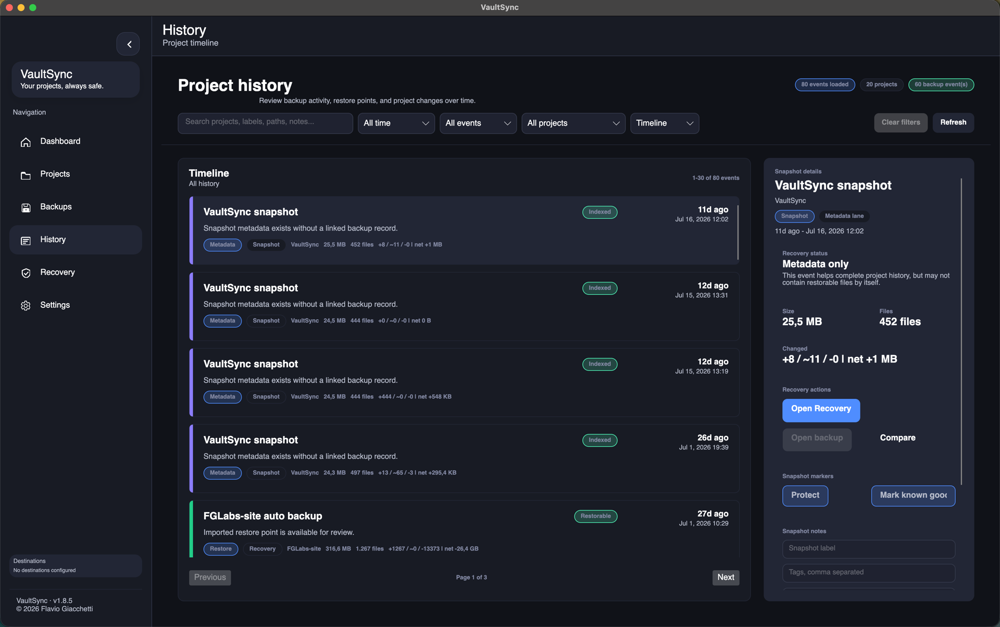
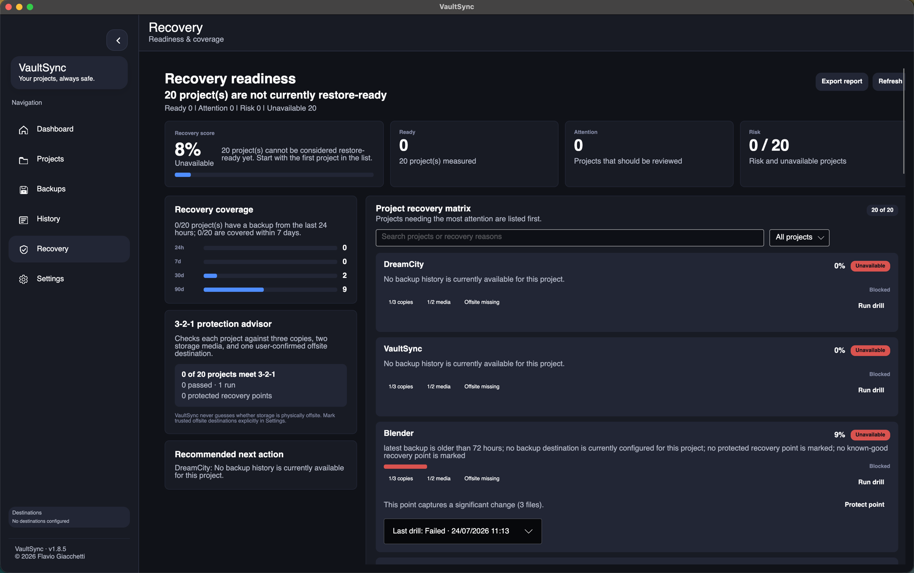
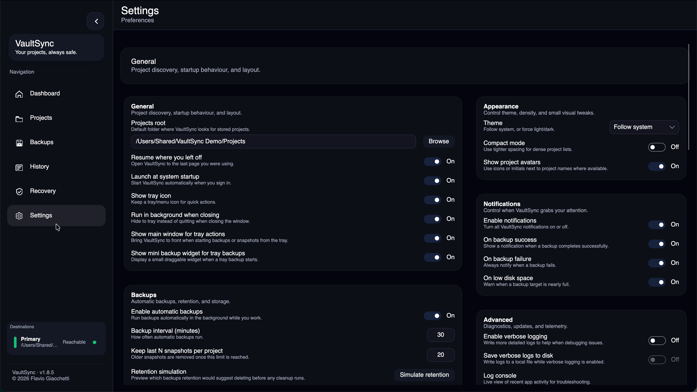
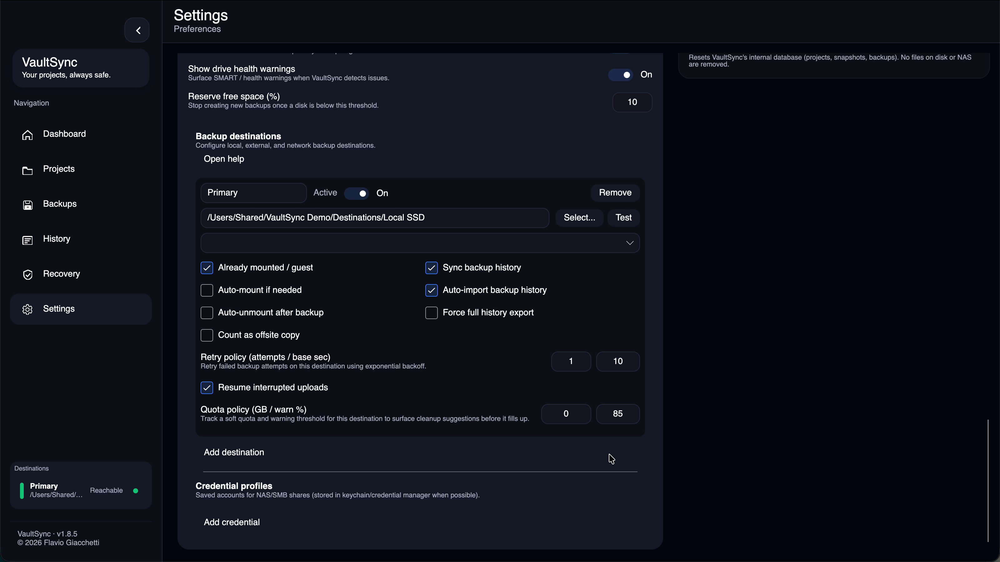
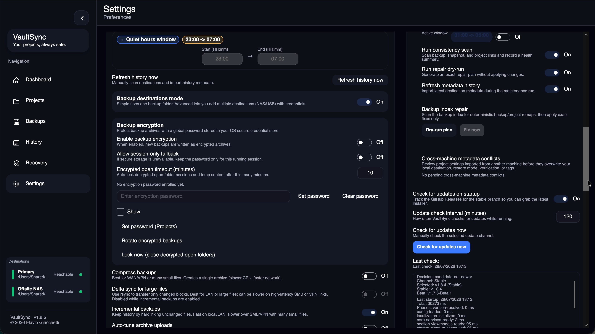
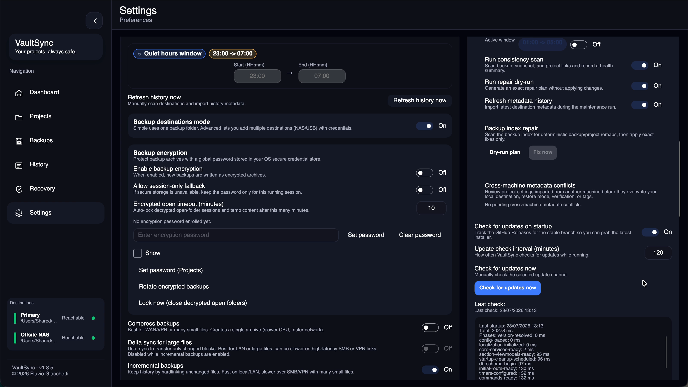

# Guided tour

This page follows the same path as first-run onboarding and then explains the
rest of the app. If you already skipped onboarding, you can use this page
without resetting VaultSync.

## The eight main pages

| Page | Use it for |
| --- | --- |
| Dashboard | Check restore readiness, required action, next run, newest known-good point, activity, and storage. |
| Projects | Discover and group folders; register, edit, pause, remove, and snapshot projects. |
| Schedule | Choose manual or automatic protection and understand the next run or delay. |
| Backups | Run backups, tune each project, inspect restore points, compare snapshots, and restore. |
| History | Search all recorded activity and maintain labels, notes, tags, and protected points. |
| Recovery | Measure restore readiness, run read-only drills, review 3-2-1 coverage, and export a report. |
| Settings | Configure automation, destinations, encryption, storage safety, appearance, alerts, updates, and diagnostics. |
| Guide | Review workflows and the shared backup and recovery terminology. |

## First-run onboarding

The onboarding card tracks actual setup state. You can click the app behind it
and complete each action without skipping the tour.

1. Read the introduction and select **Next**.
2. Select **Open Settings**, then set **Projects root**.
3. Set a **Fallback backup location**, or enable advanced destinations and add
   one active destination.
4. Open **Projects** and register one project.
5. Open **Schedule** and review or choose the protection timing.
6. Open **Backups** and create the first restore point.
7. Review that restore point in **Backups**.
8. Open **Recovery** and run a drill. **Finish** becomes available only after
   the drill passes.

**Back** revisits the previous instruction. **Skip** closes the guide; it does
not change or delete any configuration.

## Dashboard

- **Restore readiness**, **Required action**, **Next run**, and **Known good**
  put the most useful decisions first.
- Each overview card opens the page that can explain or resolve its state.
- **Backups this week** separates automatic, manual, and imported activity.
- **Recent activity** shows the newest backup events.
- **Storage usage** shows the largest consumers and can be sorted.

## Projects

- Register a discovered folder before VaultSync starts tracking it.
- Choose a preset to apply suitable `.vaultsyncignore` rules.
- Create snapshots independently of copying them to a destination.
- Use project tags and avatars to keep larger libraries readable.
- Edit destination, preset, exclusions, tags, encryption, and automatic-backup
  state without leaving Projects.
- Groups summarize member health and provide group snapshot, backup, pause, and
  resume actions.
- Remove shows an exact preview: local registration and indexed history are
  removed, while source files and stored backup payloads remain untouched.

## Schedule

- Choose manual protection or an automatic interval.
- Set quiet hours without losing sight of the effective next run.
- When a run is delayed, read the reason instead of guessing whether the
  scheduler is working.

## Backups

- **Backup all** runs eligible registered projects.
- A project can enable automatic backups, choose a preferred destination,
  override encryption, set its restore mode, and set its verification policy.
- **Keep** protects an important restore point from normal retention cleanup.
- **Explore** browses a reachable folder or archive.
- **View diff** and **Compare** explain what changed between restore points.
- **Restore** copies selected backup content to a safe target chosen by you.
- A verification failure offers an explicit choice to keep or delete the
  affected backup; VaultSync does not silently discard it.

## History

- Search by project or recorded detail.
- Filter by project, event type, date range, and protected state.
- Edit a selected snapshot's label, tags, and note.
- Protect or unprotect a point, compare it, open its backup, or continue to
  Recovery.

## Recovery

- **Recovery score** summarizes whether current restore points can be used.
- **Recovery coverage** shows the newest backup available within 24-hour,
  7-day, 30-day, and 90-day windows.
- The **3-2-1 protection advisor** checks three copies, two storage media, and
  one destination that you explicitly marked as offsite.
- Run a drill to prove linkage, reachability, readable inventory, stored bytes,
  and a read-only restore plan. A drill never writes into the live project.
- **Export report** creates a shareable Markdown readiness report.

## Guide

- Topic cards connect everyday actions to Projects, Schedule, Backups,
  History, and Recovery.
- The glossary keeps backup, snapshot, restore point, verification, known
  good, protected, and recovery drill distinct.

## Settings

Settings are intentionally presented as one scrollable page. The complete
control-by-control explanation is in [Settings reference](Settings-Reference.md).

### General, scheduling, and transfer

This area controls startup behavior, automatic-backup timing, retention
simulation, history synchronization, quiet hours, and bandwidth limits.

### Destinations

Advanced destinations expose mount ownership, offsite classification, history
sync, retry and resume behavior, quota planning, and credential selection.

### Encryption and performance

Encryption credentials, compression, delta transfer, incremental backups,
hashing, verification, and scan-cache tradeoffs are kept together so their
dependencies remain visible.

### Maintenance and updates

Diagnostics and maintenance use reviewable scans and dry-run plans. Update
status, metadata-conflict choices, and repair actions remain explicit.
Reset, cache clearing, forgetting the local project index, credential removal,
and encryption-password removal each show their exact effect before execution.

### Themes

  
  

## Tray, mini widget, and notifications

- The tray menu can open VaultSync, run Backup all or Snapshot all, open recent
  backups, and quit the background process.
- The optional mini widget follows tray-started backup progress without opening
  the main window.
- Notifications can report successes, failures, and low disk space
  independently.

## Safe next steps

After the first backup, run a Recovery drill, test every advanced destination,
and compare two restore points. Those three actions prove that VaultSync is not
only creating data, but that you can find, read, and understand it.
