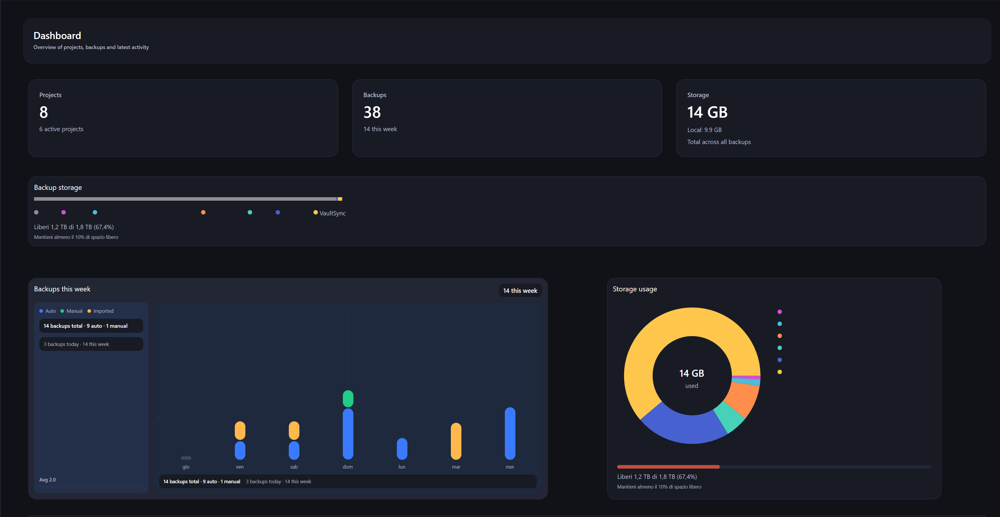

# VaultSync Wiki

Use this wiki for user-facing workflows and troubleshooting.

Current stable is **1.8.9**, published September 16, 2026. The **1.9** CLI and
recovery architecture are in development; see [development status](Development-Status.md)
and the [development CLI guide](CLI-Development.md) before using preview commands.

## Getting Started
- [Quick start](Quick-Start.md)
- [Guided app tour](Guided-Tour.md)
- [Installation](Installation.md)
- [Configuration](Configuration.md)
- [Every setting and toggle](Settings-Reference.md)

## Backups and Storage
- [Backups overview](Backups.md)
- [Backup pipeline](Backup-Pipeline.md)
- [Backup encryption](Encryption.md)
- [Destinations](Destinations.md)
- [Metadata sync](Metadata-Sync.md)
- [Network shares](Network-Shares.md)
- [Snapshots](Snapshots.md)
- [Recovery](Recovery.md)
- [Tray menu](Tray.md)

## Updates
- [Updates](Updates.md)

## Recovery Horizon development (1.9)
- [Current development, release gates, and PR stack](Development-Status.md)
- [CLI backup, verification, selective restore, and watcher plans](CLI-Development.md)
- [Delivery Project](https://github.com/users/ATAC-Helicopter/projects/7)

## Chronicle (1.8) focus areas
- History, Snapshot Explorer, and comparisons explain what changed between restore points.
- Recovery drills prove that bounded stored bytes remain readable without touching live project data.
- The 3-2-1 advisor measures reachable copies, distinct storage media, and user-confirmed offsite coverage.
- Protected points and byte-proof retention floors preserve important recovery baselines.

## Support
- [Troubleshooting](Troubleshooting.md)
- [FAQ](FAQ.md)
- [Reporting bugs](Reporting-Bugs.md)

## Repository Docs
- [Documentation index](../README.md)
- [Documentation hub](../../DOCUMENTATION.md)
- [Roadmap](../../ROADMAP.md)
- [Changelog](../../CHANGELOG.md)
- [Contributing](../../CONTRIBUTING.md)
- [Security](../../SECURITY.md)
